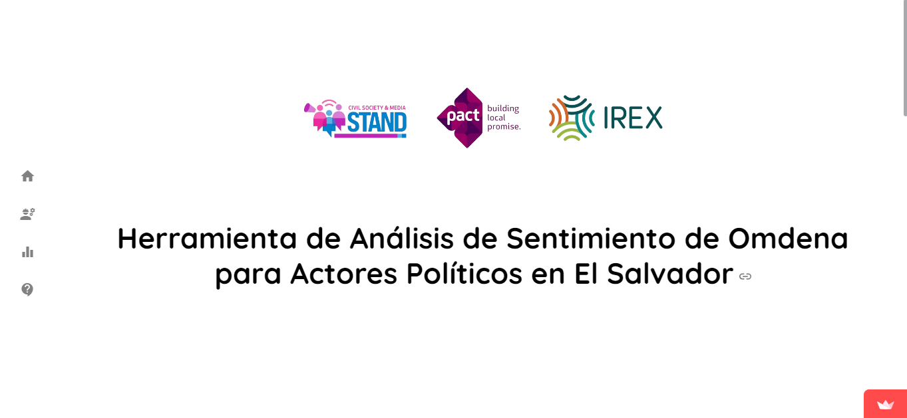
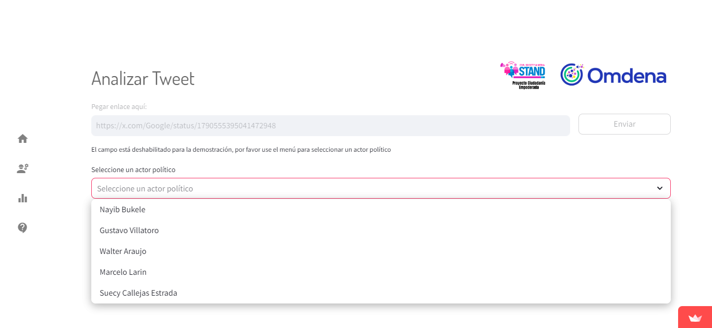
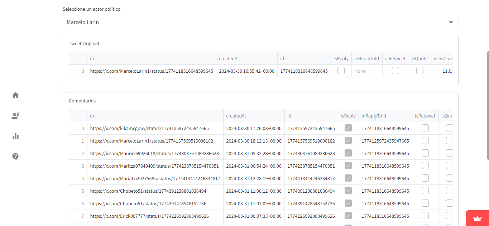
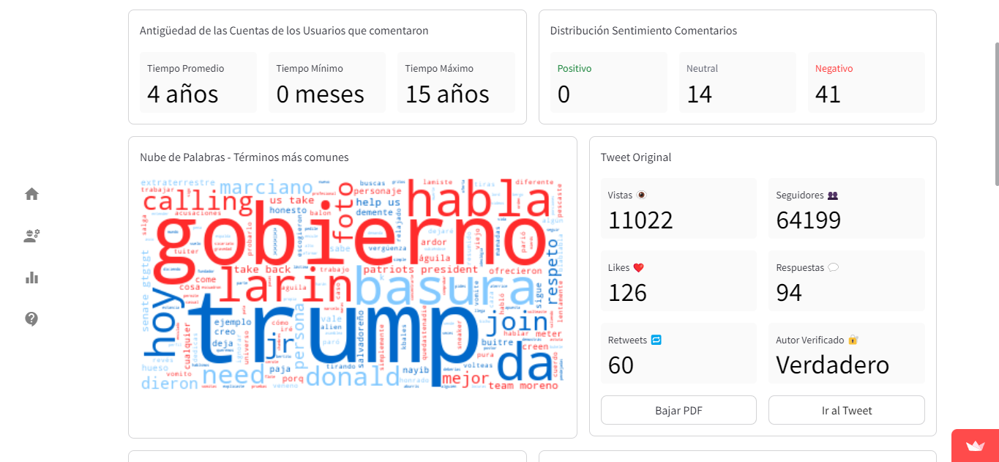
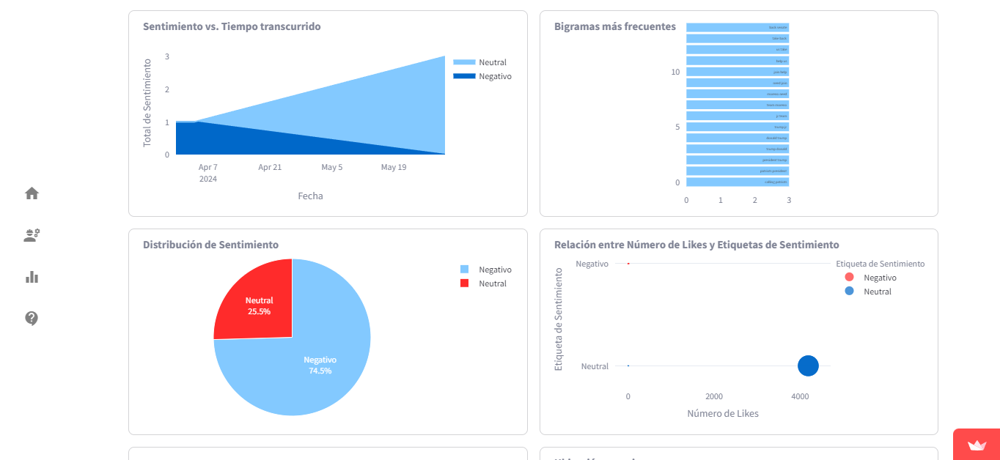
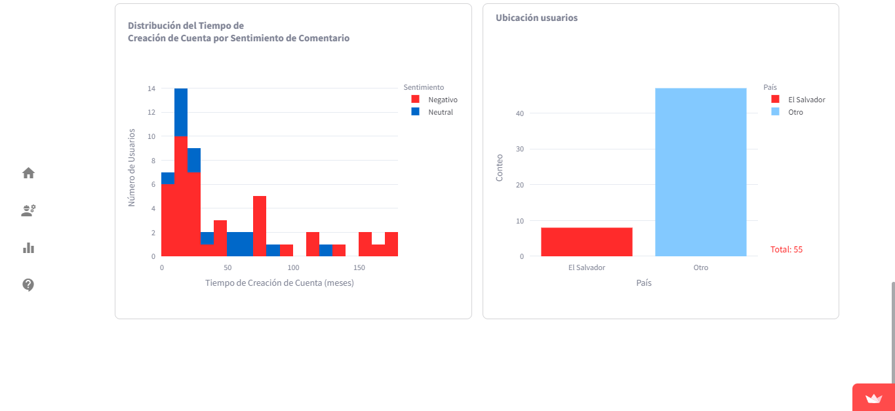

<h1 style="font-size: 24px; font-weight: bold; text-align: center; padding: 10px; border: 2px solid #888;">Omdena's Sentiment Analysis Tool for Political Actors in El Salvador - Streamlit App</h1>

### Application's URL: <https://irex-el-salvador-sentiment-tool.streamlit.app/>

## Overview

`Omdena's Sentiment Analysis Tool for Political Actors in El Salvador` is a web application developed using the Streamlit framework. It allows users to perform sentiment analysis on the comments of selected political actor's tweets (via tweet URL pasting, rendering the comments live; or using pre-loaded tweets and comments) and display a dashboard that showcases different metrics related to both the original post and the comments. Additional features such as dataset download and pdf report download are also available.

## General File Structure and Content

<details>
  <summary>Click here to expand the application's file structure graphic</summary>

```
IREX-El-Salvador-Sentiment-Tool
+---.streamlit
|   config.toml
|   secrets.toml
|
+---modules
|   __init__.py
|   cache_functions.py
|   constants.py
|   generate_pdf.py
|   graph_functions.py
|   scraper.py
|   sidebar.py
|   utils.py
|
+---nltk_data
|   +---corpora
|   |   \---stopwords
|   |   |   stopwords.zip
|   +---tokenizers
|   |   \---punkt
|   |   |   punkt.zip
|   |
|  
+---src
|   analyse1.png
|   analyse2.png
|   dashboard1.png
|   dashboard2.png
|   dashboard3.png
|   home.png
|
+---st_pages
|   __init__.py
|   about.py
|   analyse.py
|   dashboard.py
|   home.py
|
+---static
|   +---css
|   |   styles.css
|   +---dataset
|   |   \---sample_datasets
|   |   |   gustavo_villatoro_tweet_comments.parquet
|   |   |   gustavo_villatoro_tweet.parquet
|   |   |   marcelo_larin_tweet_comments.parquet
|   |   |   marcelo_larin_tweet.parquet
|   |   |   nayib_bukele_tweet_comments.parquet
|   |   |   nayib_bukele_tweet.parquet
|   |   |   suecy_callejas_estrada_tweet_comments.parquet
|   |   |   suecy_callejas_estrada_tweet.parquet
|   |   |   walter_araujo_tweet_comments.parquet
|   |   |   walter_araujo_tweet.parquet
|   |   |
|   |
|   +---html
|   |   about.html
|   |
|
|   +---img
|   |   banner.png
|   |   favicon.png
|   |   omdena_logo.png
|   |   pce.png
|   |
|
|___.gitignore
|___app.py
|___README.md
|___requirements.txt
```

</details>

## Setup

The application was built to be compatible with Streamlit Cloud. It contains a `requirements.txt` file that is used by the platform to build the container. The directory `.streamlit` contains the `config.toml` file, with some general settings. If used locally, file `secrets.toml` needs to be added to this directory too. Otherwise, the secret environment variables need to be added in Streamlit cloud settings. The secret variables are:

```TOML
APIFY_TOKEN = ""
MODEL_KEY = ""
```

* `APIFY_TOKEN`: Token for the [Tweet Scraper V2 (Pay Per Result) - X / Twitter Scraper](https://apify.com/apidojo/tweet-scraper).
* `MODEL_KEY`: Key used to login to the [Hugging Face](https://huggingface.co/) platform to access the gated model developed for this project, which can be found [here](https://huggingface.co/sagar213/bert-base-spanish-wwm-uncased-finetuned-political_elsalvadore).

## Modules directory

This directory hosts several files with different kinds of auxiliary/utilitarian functions that assist in the application's startup or complement the application's main pages, performing data transformations and building visualizations.

## NLTK Data directory

Given the nature of the NLTK library, this directory is needed for the initial install of stopwords and tokenizers.

## ST Pages directory

Contains one file per streamlit page present at the main menu.

## Static directory

* ### CSS

    Contains the css stylesheet, use in the home page and other rendered html.

* ### Dataset

    The sample datasets feature 5 different political actors, with one parquet file per actor's original tweet and one file for all the comments related to that original tweet. Format is parquet, to ensure data type preservation.

* ### HTML

    Here is the html code for the About page.

* ### IMG

    The static images (logos and icon) are served from here.

## Application's Root Directory

* `app.py` is the file where the app gets launched from. It'll setup app's tab name, run a couple small functions setting session variables, cache the data and resouces needed to run the app, and call the sidebar and home page. It works as a mono page app.

## Screenshots


<table>
    <tr>
        <th>Home Page</th>
        <th>Analysis Page - Options</th>
    </tr>
    </tr>
        <td></td>
        <td></td>
    </tr>
    <tr>
        <th>Analysis Page - Datasets</th>
        <th>Dashboard Page - Top</th>
    </tr>
    <tr>
        <td></td>
        <td></td>
    </tr>
    <tr>
        <th>Dashboard - Middle</th>
        <th>Dashboard - Bottom</th>
    </tr>
    <tr>
        <td></td>
        <td></td>
    </tr>
</table>
